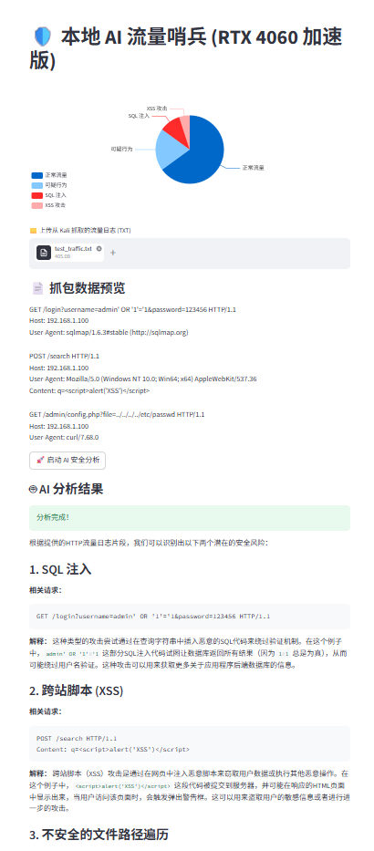
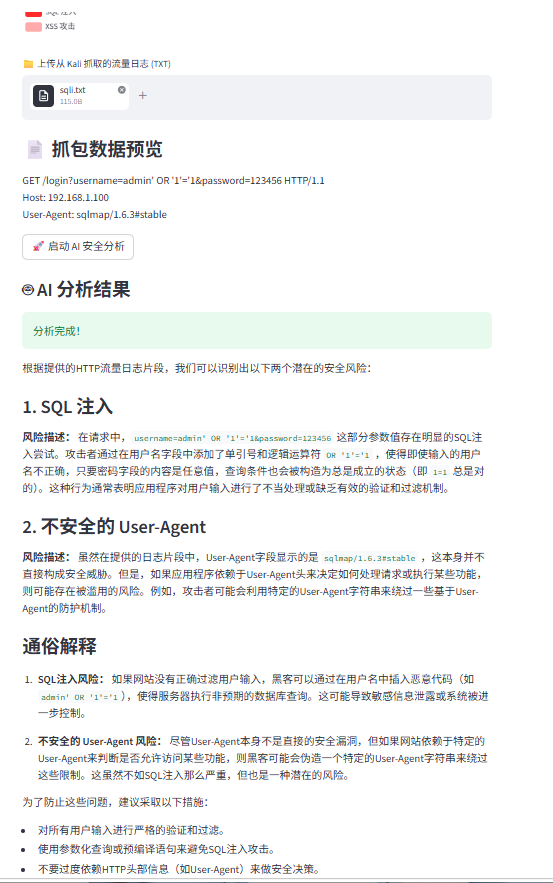

# 🛡️ 本地 AI 流量哨兵 (AI Network Sentinel)

> 基于本地大模型的 Web 流量威胁分析系统 | 毕业设计项目


## 📌 项目简介

本项目在 **NVIDIA RTX 4060 Laptop GPU** 上，基于 **LangChain + Ollama** 本地部署 **Qwen2.5-7B** 大语言模型，结合 Kali Linux 的 TShark 抓包能力，实现对 HTTP 流量的语义级安全分析。系统能够精准识别 SQL 注入、XSS 攻击等常见 Web 威胁，并输出**中文解释性报告**。全程数据不出本地，保障隐私安全。

**核心亮点**：
- ✅ 支持**批量上传**多个流量日志，带进度条
- ✅ 支持**单文件多威胁识别**（一个文件可同时标出 SQLi + XSS）
- ✅ 侧边栏 ECharts 饼图**动态累计**检测结果
- ✅ 一键重置统计，便于多次演示

## ✨ 功能展示

### 批量上传与动态统计


### 多威胁识别示例（混合攻击）
  <!-- 你如果有混合威胁截图，可以替换为实际文件名 -->

## 🛠️ 技术栈

| 层级 | 技术 |
| :--- | :--- |
| AI 引擎 | LangChain、Ollama、Qwen2.5-7B |
| 前端 | Streamlit、ECharts |
| 流量采集 | TShark (Kali Linux) |
| 硬件加速 | NVIDIA RTX 4060 Laptop GPU + CUDA 12.7 |
| 语言 | Python 3.11 |

## 📁 项目结构
AI_Network_Sentinel/
├── src/ # 源代码
│ └── app.py # 主程序
├── data/raw_captures/ # 测试流量样本
├── docs/ # 架构图、演示截图
├── models/ # 模型说明
├── requirements.txt # Python 依赖清单
├── start_ai_sentinel.bat # 一键启动脚本（Windows）
└── README.md

## 🚀 快速启动

### 环境要求
- Windows 10/11
- NVIDIA 显卡（显存 ≥ 8GB），已安装 CUDA 驱动
- Python 3.11
- Ollama（需提前下载模型：`ollama pull qwen2.5:7b`）

### 安装步骤

1. 克隆仓库
```bash
git clone https://github.com/NPC520/-AI-.git
cd -AI-
2.创建并激活虚拟环境
python -m venv venv
venv\Scripts\activate   # Windows
3.安装依赖
pip install -r requirements.txt
4.启动 Ollama 服务（确保模型已下载）
ollama run qwen2.5:7b
5.运行 Streamlit 应用
streamlit run src/app.py
或者直接双击项目根目录下的 start_ai_sentinel.bat 一键启动。
📊 使用说明
点击“Browse files”上传一个或多个 .txt 流量日志。
点击“启动 AI 安全分析（批量处理）”。
系统将依次分析每个文件，并实时更新侧边栏饼图。
最后一个文件的详细分析报告显示在主区域。
点击“重置统计数据”可清空饼图。
📝 测试用例
项目中 data/raw_captures/ 提供了三个测试样本：
normal.txt：正常浏览流量
sqli.txt：SQL 注入攻击（sqlmap 工具特征）
xss.txt：跨站脚本攻击（<script>alert('XSS')</script>）
👤 作者
姓名：李自立
学校：安徽科技科技工程大学
专业：数据科学与大数据技术
联系：npcohoh@outlook.com

如果本项目对你有帮助，欢迎 Star ⭐️